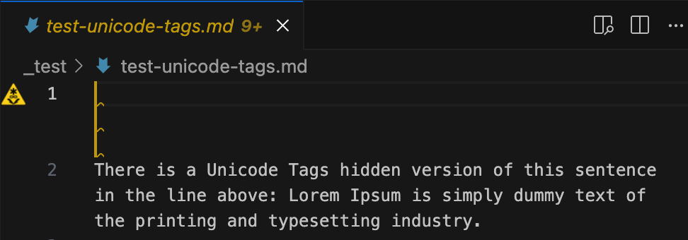
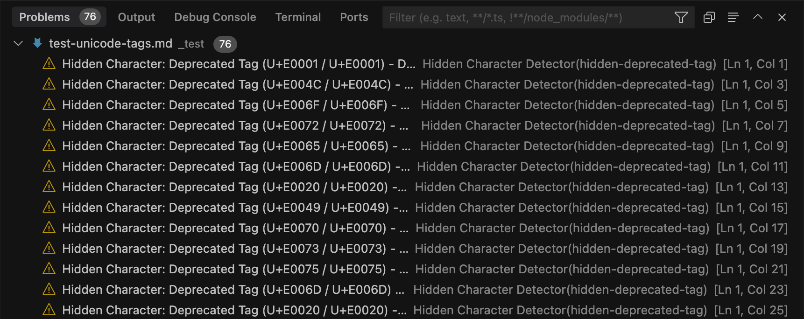

# Hidden Character Detector

   

A VS Code extension that helps you identify potentially problematic hidden Unicode characters and sequences within your code and text files, which are often used in **ASCII Smuggling** attacks. Detecting these hidden elements is crucial for preventing security vulnerabilities and unexpected behavior caused by obfuscated code or data.

## Preventing ASCII Smuggling 🛡️

The core goal of this extension is to combat **ASCII Smuggling**, a technique where malicious actors embed harmful code or data within seemingly innocuous text files using invisible or non-standard Unicode characters. These hidden elements can bypass security scanners, code reviews, and analysis tools, potentially leading to vulnerabilities like command injection or cross-site scripting (XSS).

✅ **How this extension helps:**

By detecting and highlighting a wide range of hidden characters (including zero-width spaces, bidirectional control characters, invisible formatters, and deprecated tags) and suspicious sequences used for binary encoding, this extension alerts you to these hidden threats. This allows developers and security reviewers to identify and remove potentially malicious content before it can cause harm, thus preventing ASCII Smuggling attacks.

## Features ✨

*   **🔍 Detects Individual Hidden Characters:** Scans files for various categories of invisible or non-rendering characters, including:
    *   **Zero-Width Characters:** (e.g., `U+200B` Zero Width Space, `U+200D` Zero Width Joiner)
    *   **Bidirectional Control Characters:** (e.g., `U+202E` Right-to-Left Override) which can alter text display order.
    *   **Invisible Formatting Characters:** (e.g., `U+2028` Line Separator)
    *   **Deprecated Tag Characters:** (e.g., `U+E0001` Language Tag)
    *   **Variation Selectors:** Which can modify the appearance of preceding characters (with heuristics to reduce false positives in valid emoji sequences).
*   **👾 Detects Potential Binary Encoding:** Identifies sequences (8 characters or more) of specific zero-width characters often used to hide binary data or malicious scripts within text.
*   **📁 Workspace Scanning:** Performs automatic background scans of the entire workspace and offers a manual command (`Hidden Character: Scan Entire Workspace`) for on-demand checks.
*   **⚙️ Configurable Exclusions:** Allows specifying files and folders to ignore during scans via the `hiddenCharacterDetector.excludePatterns` setting (supports glob patterns).
*   **💾 Scan on Save:** Automatically scans the active file when you save it (configurable via `hiddenCharacterDetector.scanOnSave`).
*   **ℹ️ Provides Detailed Information:** For each finding, the extension shows:
    *   The character (e.g., `U+200B`) or pattern type.
    *   Its exact location (line, column).
    *   The category of the character (e.g., "Zero-Width", "Bidirectional Control").
    *   A message explaining the potential risk or purpose.

## Installation 🚀

1.  Open **Visual Studio Code** or any compatible VS Code-based IDE.
2.  Go to the **Extensions** view (`Ctrl+Shift+X` or `Cmd+Shift+X`).
3.  Search for "Hidden Character Detector".
4.  Click **Install**.
5.  Alternatively, launch VS Code Quick Open (`Ctrl+P` or `Cmd+P`), paste `ext install yusufdanis.hidden-character-detector`, and press Enter.

## Usage 💡

The extension automatically scans:
*   Files as you open or switch to them.
*   Files when you save them (if `hiddenCharacterDetector.scanOnSave` is enabled, default: true).
*   The entire workspace periodically in the background (if `hiddenCharacterDetector.automaticWorkspaceScan.enabled` is enabled, default: true).

You can also trigger scans manually:
*   **Active Editor:** Run the command `Hidden Character: Scan Active Editor` from the Command Palette (`Ctrl+Shift+P` or `Cmd+Shift+P`).
*   **Entire Workspace:** Run the command `Hidden Character: Scan Entire Workspace`.

Findings will be highlighted in the editor and listed in the Problems panel (`Ctrl+Shift+M` or `Cmd+Shift+M`). You can configure scanning behavior and exclusion patterns in your VS Code settings (`Ctrl+,` or `Cmd+,`) under "Hidden Character Detector".

## Configuration Options ⚙️

*   `hiddenCharacterDetector.scanOnSave` (boolean, default: `true`): Scan the active file on save.
*   `hiddenCharacterDetector.automaticWorkspaceScan.enabled` (boolean, default: `false`): Enable periodic background scanning of the workspace.
*   `hiddenCharacterDetector.automaticWorkspaceScan.intervalSeconds` (number, default: `60`): Frequency (in seconds) for automatic workspace scans.
*   `hiddenCharacterDetector.excludePatterns` (array of strings, default: see settings): Glob patterns for files/folders to exclude from all scans.

## Known Issues 🐛

Currently, there are no known issues. Please report any bugs you find!

## Contributing ❤️

We welcome contributions and suggestions! Please feel free to open an issue if you find a bug or have a feature request. Pull requests are also appreciated.
